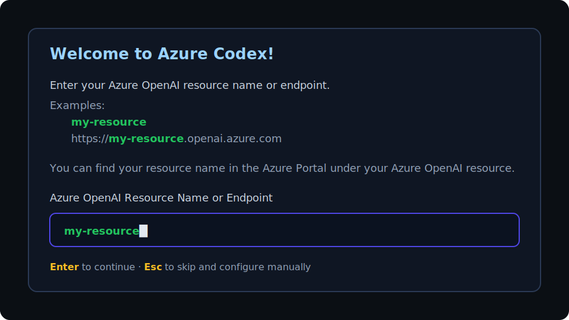

<p align="center">
  
</p>

<h1 align="center">Azure Codex</h1>

<p align="center">
  <strong>A fork of OpenAI's Codex CLI optimized for Azure OpenAI Service</strong>
</p>

<p align="center">
  <a href="#features">Features</a> |
  <a href="#screenshots">Screenshots</a> |
  <a href="#quickstart">Quickstart</a> |
  <a href="#azure-setup--rbac-azure-openai--azure-ai-foundry">Azure setup &amp; RBAC</a> |
  <a href="#configuration">Configuration</a> |
  <a href="#authentication">Authentication</a> |
  <a href="#commands">Commands</a> |
  <a href="#troubleshooting">Troubleshooting</a>
</p>

---

## Overview

**Azure Codex** is a fork of [OpenAI's Codex CLI](https://github.com/openai/codex) built specifically for **Azure OpenAI Service**. It focuses on:

- Azure Entra ID authentication (Azure CLI, Managed Identity, Service Principal, Device Code Flow)
- Automatic discovery of your Azure OpenAI deployments
- Fast model/endpoint switching during a session

If you provision models via **Azure AI Foundry** (formerly Azure AI Studio), Azure Codex still connects to the underlying **Azure OpenAI** resource endpoint (for example `https://{resource}.openai.azure.com`) and uses your **deployment name** as the `model`.

---

## Features

- **Interactive setup wizard** on first run (endpoint -> deployment -> reasoning effort)
- **Azure-native auth** via Azure Entra ID (plus optional API key support)
- **Deployment discovery** so you pick from what your resource actually has deployed
- **Dynamic switching**
  - `/model` to switch deployments (+ reasoning effort)
  - `/endpoint` to switch Azure OpenAI resources
- **Sandboxed command execution** (Windows & Linux)
- **Review + auto-fix loop** to iterate until the reviewer is satisfied
- **Auto-resume on transient stream disconnects** (replays a "Keep going" turn)
- MCP (Model Context Protocol) support, git integration, file mentions (`@`), skills (`$`), session resume

---

## Screenshots



---

## Quickstart

### Prerequisites

- **Azure OpenAI resource** with at least one GPT model deployment
- **Azure CLI**: [aka.ms/installazurecli](https://aka.ms/installazurecli)
- **RBAC access** to call the Azure OpenAI endpoint (see the next section)
- **Rust toolchain** (only if building from source): [rustup.rs](https://rustup.rs)

### Install

#### Option A: build from source (recommended for this fork)

```bash
git clone https://github.com/Arthur742Ramos/azure-codex.git
cd azure-codex/codex-rs
cargo build -p codex-cli --release

# Linux/macOS
./target/release/codex

# Windows
.\target\release\codex.exe
```

#### Option B: install from a local checkout (adds `codex` to your Cargo bin dir)

```bash
git clone https://github.com/Arthur742Ramos/azure-codex.git
cd azure-codex
cargo install --path codex-rs/cli --locked
codex --version
```

### First run

1. Sign in:
   ```bash
   az login
   ```
2. Run:
   ```bash
   codex
   ```
3. Follow the wizard:
   - enter your Azure OpenAI resource name or full endpoint
   - choose a deployment
   - choose reasoning effort (for reasoning models)

---

## Azure Setup & RBAC (Azure OpenAI / Azure AI Foundry)

Azure Codex supports **Azure Entra ID** auth (recommended) and **API key** auth. If you're using Entra ID (Azure CLI / Managed Identity / Service Principal / Device Code Flow), you must grant your identity an Azure RBAC role on the **Azure OpenAI resource**.

### 1) Create a deployment (Portal or Foundry)

- Create or pick an existing **Azure OpenAI** resource.
- Create at least one **deployment**.
  - The **deployment name** is what Azure Codex calls `model`.

In **Azure AI Foundry**, you can typically copy:
- **Endpoint**: `https://{resource}.openai.azure.com`
- **Deployment name**: shown in Deployments / Models views

### 2) Assign RBAC roles on the Azure OpenAI resource

Minimum recommended role (run inference + list deployments):
- `Cognitive Services OpenAI User`

If you also need to create/update deployments:
- `Cognitive Services OpenAI Contributor` (or broader roles like `Contributor`)

Assign at the **Azure OpenAI resource scope** (`Microsoft.CognitiveServices/accounts/{resource}`):

```bash
# Fill these in
RESOURCE_GROUP="my-rg"
AOAI_RESOURCE_NAME="my-openai-resource"
ASSIGNEE="<user-upn-or-sp-appId-or-objectId>"

SCOPE_ID="$(az cognitiveservices account show -g "$RESOURCE_GROUP" -n "$AOAI_RESOURCE_NAME" --query id -o tsv)"
az role assignment create --assignee "$ASSIGNEE" --role "Cognitive Services OpenAI User" --scope "$SCOPE_ID"
```

PowerShell equivalent:

```powershell
$ResourceGroup = "my-rg"
$AoaiResourceName = "my-openai-resource"
$Assignee = "<user-upn-or-sp-appId-or-objectId>"
$ScopeId = az cognitiveservices account show -g $ResourceGroup -n $AoaiResourceName --query id -o tsv
az role assignment create --assignee $Assignee --role "Cognitive Services OpenAI User" --scope $ScopeId
```

Verify (optional):

```bash
az role assignment list --assignee "$ASSIGNEE" --scope "$SCOPE_ID" -o table
```

### 3) Validate access to the data plane (optional but useful)

```bash
API_VERSION="2025-04-01-preview"
TOKEN="$(az account get-access-token --resource https://cognitiveservices.azure.com --query accessToken -o tsv)"
curl -sS "https://${AOAI_RESOURCE_NAME}.openai.azure.com/openai/deployments?api-version=${API_VERSION}" \
  -H "Authorization: Bearer ${TOKEN}"
```

PowerShell equivalent:

```powershell
$ApiVersion = "2025-04-01-preview"
$Token = az account get-access-token --resource https://cognitiveservices.azure.com --query accessToken -o tsv
Invoke-RestMethod "https://$AoaiResourceName.openai.azure.com/openai/deployments?api-version=$ApiVersion" `
  -Headers @{ Authorization = "Bearer $Token" }
```

Common failures:
- `401 Unauthorized`: missing RBAC role assignment, wrong tenant/subscription, or token acquired from the wrong identity
- `404 Not Found`: wrong endpoint/resource, or deployment name mismatch

---

## Configuration

### Config file location

| Platform | Path |
|----------|------|
| Linux/macOS | `~/.azure-codex/config.toml` |
| Windows | `%USERPROFILE%\\.azure-codex\\config.toml` |

Override with `AZURE_CODEX_HOME`.

### Minimal config

```toml
azure_endpoint = "https://your-resource.openai.azure.com"
model = "your-deployment-name"
```

### Full config example

```toml
azure_endpoint = "https://your-resource.openai.azure.com"
model = "your-deployment-name"

# For GPT-5 and o-series reasoning models
model_reasoning_effort = "medium" # low | medium | high

# API version (optional)
azure_api_version = "2025-04-01-preview"

[azure_auth]
# "default" tries methods in order (Azure CLI, Managed Identity, env creds, device code)
mode = "default"
approval_policy = "on-failure"

[sandbox]
permissions = "read-only" # read-only | workspace-write | full-access
```

### Environment variables

| Variable | Description |
|----------|-------------|
| `AZURE_CODEX_HOME` | Override config directory |
| `AZURE_OPENAI_API_KEY` | Use API key instead of Entra ID auth |
| `AZURE_TENANT_ID` | Tenant ID for service principal auth |
| `AZURE_CLIENT_ID` | Client ID for service principal auth |
| `AZURE_CLIENT_SECRET` | Client secret for service principal auth |

---

## Authentication

### Default mode (recommended)

The default mode tries multiple methods in order:

1. Azure CLI (`az login`)
2. Managed Identity (Azure-hosted workloads)
3. Environment credentials
4. Device Code Flow

```toml
[azure_auth]
mode = "default"
```

### Azure CLI

```bash
az login
az account show
```

### Managed Identity

```toml
[azure_auth]
mode = "managed_identity"
```

### Service principal

```toml
[azure_auth]
mode = "client_secret"
tenant_id = "your-tenant-id"
client_id = "your-client-id"
client_secret = "your-client-secret"
```

Or via env vars:

```bash
export AZURE_TENANT_ID="your-tenant-id"
export AZURE_CLIENT_ID="your-client-id"
export AZURE_CLIENT_SECRET="your-client-secret"
```

### API key

```bash
export AZURE_OPENAI_API_KEY="your-api-key"
```

---

## Commands

### Slash commands

| Command | Description |
|---------|-------------|
| `/model` | Choose what model and reasoning effort to use |
| `/endpoint` | Show or change the Azure OpenAI endpoint |
| `/approvals` | Choose what Codex can do without approval |
| `/skills` | Use skills to improve how Codex performs specific tasks |
| `/review` | Review current changes and find issues |
| `/review-fix` | Review and auto-fix until no issues remain (up to 5 iterations) |
| `/loop` | Repeat the next prompt in an autonomous loop |
| `/cancel-loop` | Stop the current autonomous loop |
| `/new` | Start a new chat during a conversation |
| `/resume` | Resume a saved chat |
| `/init` | Create an `AGENTS.md` file with instructions for Codex |
| `/compact` | Summarize conversation to prevent hitting the context limit |
| `/undo` | Ask Codex to undo a turn |
| `/diff` | Show git diff (including untracked files) |
| `/mention` | Mention a file |
| `/status` | Show current session configuration and token usage |
| `/mcp` | List configured MCP tools |
| `/togglemouse` | Toggle mouse capture for native text selection |
| `/logout` | Log out of Codex |
| `/feedback` | Send logs to maintainers |
| `/quit` | Exit Azure Codex |

### Non-interactive mode

```bash
codex exec "Create a hello world script"
codex exec --model your-deployment-name "Refactor this function"
codex exec --skip-git-repo-check "Explain this code"
codex exec --fix "Review this code and fix any issues"
```

---

## Model Switching

- `/model` switches deployments immediately (and lets you adjust reasoning effort)
- `/endpoint` switches Azure OpenAI resources and re-discovers deployments

---

## Architecture

```text
azure-codex/
  codex-rs/                 Rust implementation
    core/                   Core library (includes Azure integration)
    cli/                    `codex` binary (entry point)
    tui2/                   Terminal UI (onboarding lives here)
    exec/                   Non-interactive mode
  docs/                     Documentation
```

---

## Development

```bash
cargo check -p codex-cli
cargo build -p codex-cli
cargo build -p codex-cli --release
cargo test
```

---

## Troubleshooting

### "Failed to run az CLI"

- Windows: ensure Azure CLI is installed and `az.cmd` is in `PATH`
- Linux/macOS: ensure `az` is installed and on `PATH`

```bash
az --version
az login
```

### "Resource not found" / `404 DeploymentNotFound`

Your `model` must equal the **deployment name**:

```bash
az cognitiveservices account deployment list \
  --name your-resource-name \
  --resource-group your-rg \
  -o table
```

### "Authentication failed" / `401 Unauthorized`

- confirm the active identity/tenant: `az account show`
- confirm RBAC role assignment: `Cognitive Services OpenAI User` on the Azure OpenAI resource

```bash
az account get-access-token --resource https://cognitiveservices.azure.com
```

---

## Differences from OpenAI Codex

| Feature | OpenAI Codex | Azure Codex |
|---------|--------------|-------------|
| Authentication | ChatGPT/API Key | Azure Entra ID / API key |
| Endpoint | `api.openai.com` | Your Azure endpoint |
| Model selection | Model ids | Azure deployment names |
| API | Responses API | Chat Completions API |
| First-run setup | Manual config | Interactive wizard |
| Endpoint switching | Restart required | `/endpoint` command |

---

## Contributing

Contributions are welcome. See `docs/contributing.md`.

---

## License

This project is licensed under the [Apache-2.0 License](LICENSE).

---

## Acknowledgments

- [OpenAI Codex CLI](https://github.com/openai/codex) - the upstream project this fork is based on
- [Azure OpenAI Service](https://azure.microsoft.com/products/ai-services/openai-service) - enterprise AI platform on Azure
